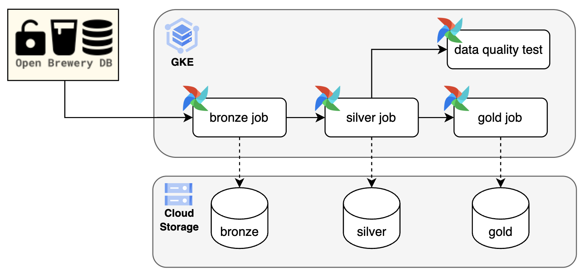

# Breweries Case: Technical Architecture Documentation

## 1. High-Level Architecture Overview

The `breweries-case` project is a modular, cloud-native data platform for ingesting, processing, validating, and analyzing brewery data at scale. It implements a layered data lakehouse architecture on Google Cloud Platform (GCP), structuring data into Bronze (raw), Silver (curated), and Gold (aggregated) layers. ETL workflows are orchestrated with Apache Airflow on Kubernetes, ensuring scalable and reliable data processing. Data quality is enforced through automated validation, and infrastructure is managed as code for reproducibility.

**Data Flow Overview:**

1. **Ingestion:** Raw data from the Open Brewery DB API is loaded into the Bronze layer in Google Cloud Storage (GCS).
2. **Curation:** The Silver layer processes and deduplicates data, storing it as Delta Lake tables in GCS.
3. **Aggregation:** The Gold layer aggregates curated data for analytics and reporting.
4. **Orchestration:** Airflow DAGs coordinate ETL jobs, running containerized workloads on Kubernetes.
5. **Validation:** Data quality checks are performed post-ingestion using PyDeequ and Spark.
6. **Consumption:** Data is accessed via notebooks or analytics tools.

    

## 2. Component Breakdown

- **Google Cloud Platform (GCP):** Hosts GCS (data lake storage), GKE (Kubernetes for workloads), and Artifact Registry (Docker images).
- **Apache Airflow:** Orchestrates ETL workflows via DAGs, triggering jobs on Kubernetes.
- **Apache Spark:** Executes distributed ETL and data quality jobs, containerized and submitted to GKE.
- **Delta Lake:** Provides ACID-compliant, scalable storage for Silver and Gold layers.
- **PyDeequ:** Performs automated data quality checks on Spark DataFrames.
- **Terraform & Helm:** Infrastructure-as-code for provisioning GCP resources and deploying Kubernetes services.

## 3. Data Lake Design

- **Bronze:** Raw ingested JSON data from APIs, stored as-is for traceability. Metadata tracks the last processed record.
- **Silver:** Cleaned, deduplicated, schema-enforced data as Delta Lake tables, partitioned for efficient access.
- **Gold:** Aggregated, analytics-ready datasets as Delta Lake tables, optimized for reporting.

**Technologies:**  
- **Storage:** GCS  
- **Format:** JSON (Bronze), Delta Lake (Silver/Gold)  
- **Partitioning:** Silver layer by `country`, `state`, and `city`

## 4. Data Pipeline Architecture

- **Bronze ETL:** Python job fetches data from API, saves to GCS, and updates metadata.
- **Silver ETL:** Spark job reads Bronze data, applies schema and deduplication, writes to Delta Lake.
- **Gold ETL:** Spark job aggregates Silver data and writes to Gold Delta Lake.

**Orchestration:**  
- Airflow DAGs define dependencies and execution order, running each ETL job in its own Kubernetes container.

**Data Movement:**  
- All data moves between layers via GCS, using Delta Lake for transactional integrity.

## 5. Monitoring & Alerting

- **Airflow:** Monitors DAG execution, logs, retries, and failures.
- **Kubernetes:** Tracks pod health, resource usage, and job logs.
- **Alerting:** Airflow sends email notifications on job failures or retries.

## 6. Data Quality Framework

- **Validation:** PyDeequ checks run as Spark jobs after Silver ingestion, enforcing schema, uniqueness, completeness, and business logic.
- **Logging:** Validation results and errors are logged for auditability.
- **Exception Handling:** Failures trigger Airflow alerts.

## 7. Infrastructure Details

- **Deployment:** All workloads run on GKE, provisioned via Terraform.
- **Resources:** GCS buckets, GKE clusters, Artifact Registry, IAM roles.
- **Kubernetes:** Manages Airflow, Spark Operator, and ETL/test jobs as pods.
- **Helm:** Deploys and configures Airflow and Spark Operator.
- **CI/CD:** Docker images are built and pushed to Artifact Registry; deployment scripts automate infrastructure and job deployment.
- **Infrastructure-as-Code:** All infra is versioned and reproducible.

## 9. Scalability & Performance Considerations

- **Horizontal Scaling:** Kubernetes auto-scales pods.
- **Partitioning:** Delta Lake tables are partitioned for efficient queries.
- **Containerization:** Each job runs in its own container for parallelism and isolation.
- **Fault Tolerance:** Airflow retries failed tasks; Kubernetes restarts failed pods.
- **Resource Optimization:** Spark jobs are tuned for memory/CPU; GKE node pools are adjustable.

## 10. Design Decisions & Trade-offs

| Decision | Rationale | Trade-offs |
|----------|-----------|------------|
| **Layered Data Lake (Bronze/Silver/Gold)** | Enables traceability, data quality, and optimized analytics | Increases storage usage and ETL complexity |
| **Delta Lake on GCS** | ACID transactions, scalable storage, open format | Requires Spark for full feature support |
| **Kubernetes Orchestration** | Scalability, isolation, cloud-native | Adds operational complexity |
| **Airflow for Workflow Management** | Mature, extensible, integrates with Kubernetes | Learning curve, requires maintenance |
| **PyDeequ for Data Quality** | Declarative, scalable validation on Spark | Limited to Spark DataFrames |
| **Terraform & Helm** | Reproducible, automated infra management | Requires infra-as-code expertise |
| **Service Account Key Injection** | Secure, avoids hardcoding secrets | Requires careful secret management |

## Summary

The `breweries-case` architecture is designed for reliability, scalability, and data quality in a modern cloud-native analytics environment. It leverages best practices in data lakehouse design, workflow orchestration, and infrastructure automation, making it robust for production workloads and extensible for future requirements.

# Improvements 
- **Service Accounts:** Implement dedicated service accounts for each component to enforce least-privilege access.
- **Network Policies:** Use Kubernetes Network Policies to restrict pod-to-pod communication, enhancing security.
- **Secret Management:** Use GCP Secret Manager or Kubernetes Secrets for managing sensitive information like API keys, database credentials, and service account keys.
- **Deploy Nginx Ingress Controller:** For better traffic management to Airflow UI.
- **Domand Name:** Consider using a custom domain for Airflow UI and other services for better accessibility.
- **GitSync for Airflow DAGs:** Use GitSync to automatically sync DAGs from a Git repository to the Airflow environment, ensuring version control and easy updates.
- **Grafana for Monitoring:** Integrate Grafana with Prometheus to visualize metrics from Airflow and Kubernetes, providing better insights into system performance.
- **NFS for Shared Storage:** Use NFS or a similar solution for shared storage between Airflow, PostgreSQL and Spark jobs, allowing for easier data access and management.
- **External PostgreSQL Database:** Consider using an external PostgreSQL database for Airflow metadata to improve performance and scalability, especially for larger deployments.

